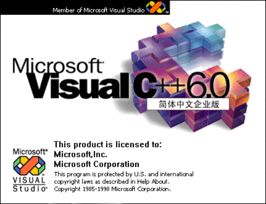
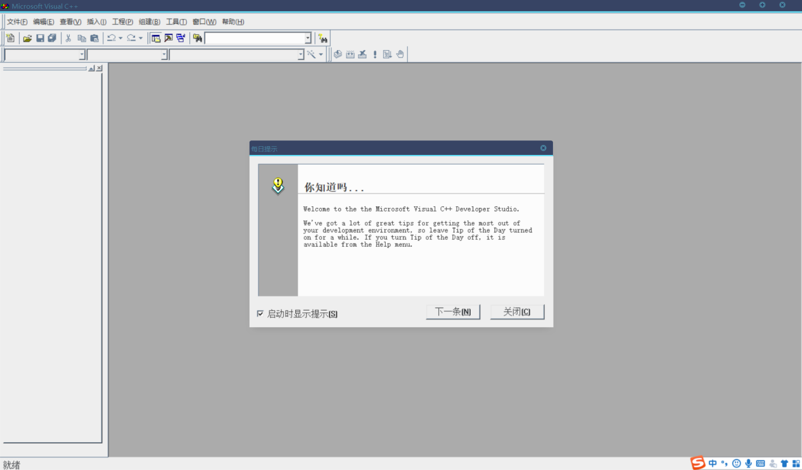
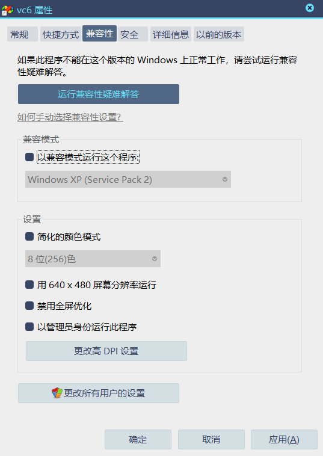

# VC6.0下载和安装

Microsoft Visual C++，（简称Visual C++、MSVC、VC++或VC）是Microsoft公司推出的以C++语言为基础的开发Windows环境程序，面向对象的可视化集成编程系统。它不但具有程序框架自动生成、灵活方便的类管理、代码编写和界面设计集成交互操作、可开发多种程序等优点。

Microsoft Visual C++ 6.0，简称VC6.0，是微软于1998年推出的一款C++编译器，集成了MFC 6.0，包含标准版（Standard Edition）、专业版（Professional Edition）与企业版（Enterprise Edition）。如今仍用于维护旧的项目。（但是，这个版本在Windows XP下运行会出现问题，尤其是在调试模式的情况下（例如：静态变量的值并不会显示）

安装完成后打开

vc6界面查看

### 兼容性
VC6能在XP系统上完美运行，在win7或win10上可能出现不兼容的情况，我们更改一下即可。右键桌面图标进入属性。

