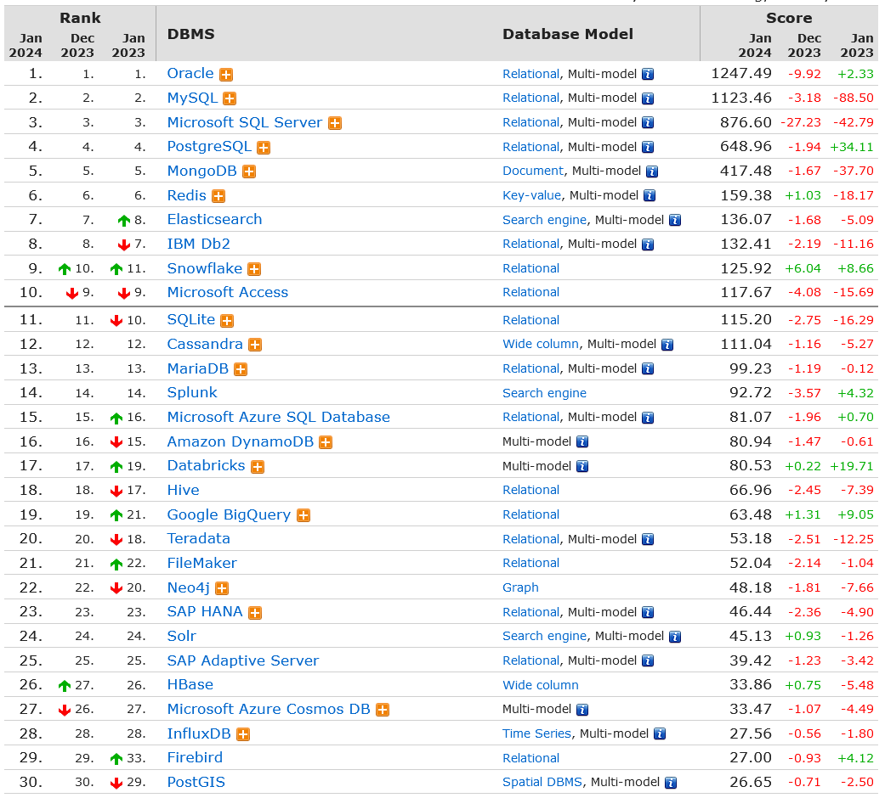

# 国产的数据库都有哪些？

当前数据库生态可以大致分类三类：

一是传统商业数据库

，以 Oracle 为代表，其在 40 余年时间里所创造的数据库帝国已拥有了极其完善的生态；

二是开源数据库，以 MySQL、PostgreSQL 为代表，遍布全球的社区组织形成了强大的生态系统，也形成了若干分支，成就了诸多商业数据库产品；

第三则是国内新兴数据库，以 TiDB、OceanBase、PolarDB 等为代表，具备较强的自研能力，但在生态方面较前两类薄弱很多。如何快速建立并形成符合自身利益的生态呢？开源无疑是一个绝佳的选择。

查看数据库排行，https://db-engines.com/en/ranking

