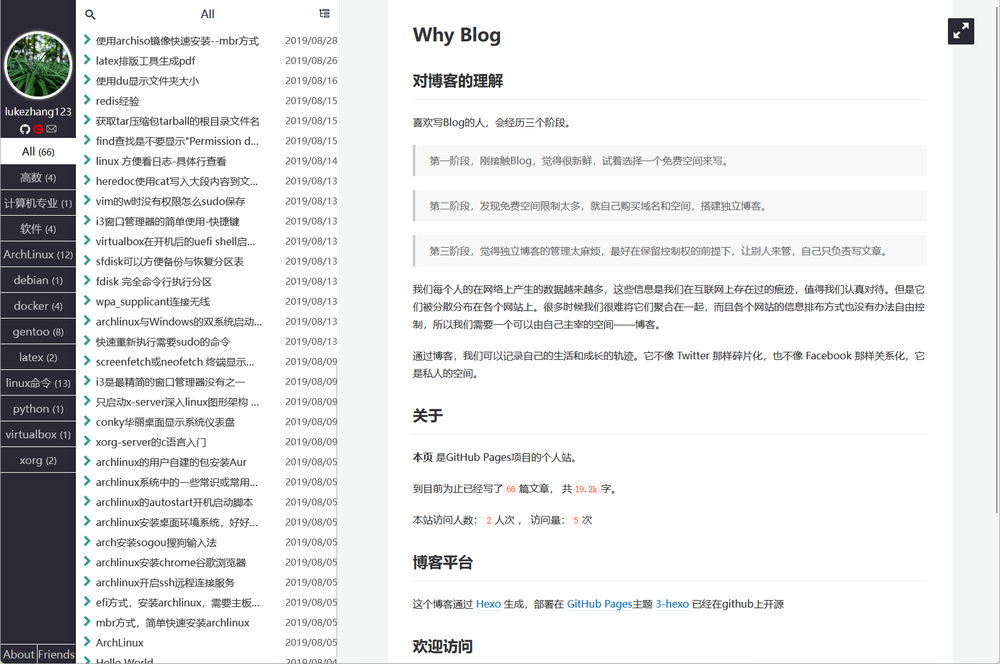

# 利用Git记录生活点滴

每个人的在网络上产生的数据越来越多，这些信息是我们在互联网上存在过的痕迹，值得我们认真对待。

曾经看到几个好用的网站，随手保存到浏览器的bookmark里，但是几个月后再打开时已经404。

Internet世界互联，拉进了人们的距离，但是信息时代，日新月异。

所以有的东西还是需要整理保存收藏，记录自己的生活和收获的轨迹。

## 个人标签

10+年ITer老兵

互联网发展见证者

数据库专家

编程语言

系统命令

## 玩玩网络

csdn记录

https://blog.csdn.net/c5113620

github pages个人页面

https://lukezhang-123.github.io/

## java, jdk核心内容整理

[java核心基础--jdk源码分析学习--基本数据类型](https://blog.csdn.net/c5113620/article/details/78722359)

[面向对象的java，一切对象的起源Object](https://blog.csdn.net/c5113620/article/details/78777954)

[java核心基础--jdk源码分析学习--String](https://blog.csdn.net/c5113620/article/details/78787809)

[java核心基础--jdk源码分析学习--Integer](https://blog.csdn.net/c5113620/article/details/78787884)

[java核心基础--jdk源码分析学习--ArrayList](https://blog.csdn.net/c5113620/article/details/78788115)

[java核心基础--jdk源码分析学习--LinkedList](https://blog.csdn.net/c5113620/article/details/78788239)

[java核心基础--jdk源码分析学习--HashMap](https://blog.csdn.net/c5113620/article/details/78789085)

[java核心基础--jdk源码分析学习--HashSet](https://blog.csdn.net/c5113620/article/details/78820973)

[java核心基础--jdk源码分析学习--Hashtable](https://blog.csdn.net/c5113620/article/details/78821290)

[java核心基础--jdk源码分析学习--TreeMap](https://blog.csdn.net/c5113620/article/details/78826287)

## java微服务，框架

[springcloud要点记录](https://blog.csdn.net/c5113620/article/details/78885686)

[微服务springcloud分布式入门-eureka服务注册与发现-zuul路由](https://blog.csdn.net/c5113620/article/details/78886209)

[springcloud中feignclient远程过程调用demo](https://blog.csdn.net/c5113620/article/details/78893557)

[springboot web跨域访问问题解决--addCorsMappings和CorsFilter](https://blog.csdn.net/c5113620/article/details/79132968)

---

## 数据库

visio studio2022 IDE源码编译开源数据库，mysql，postgresql，方便代码浏览

https://github.com/lukezhang-123/database-mysql

https://github.com/lukezhang-123/database-postgresql

---

## 其他内容，陆续整理中。。。

To be continue...

## 总结

Success is not overnight. It's when every day you get a little better than the day before.

成功并非一夜之间的事情。成功意味着你每一天都比前一天更进步一点。
